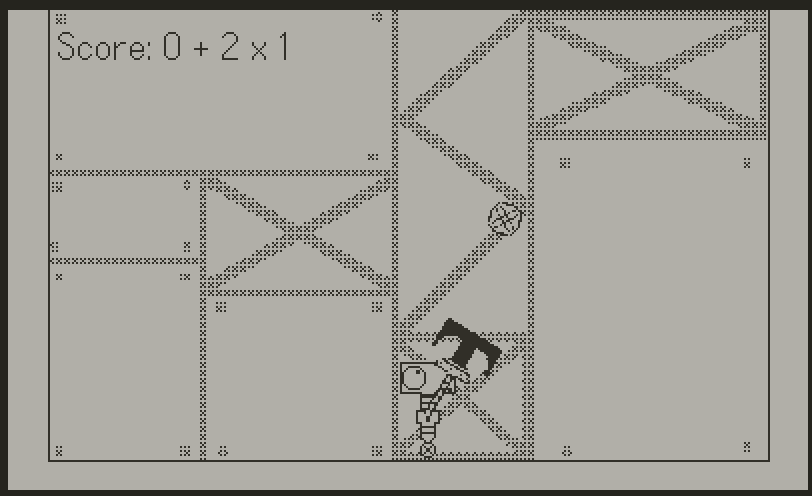
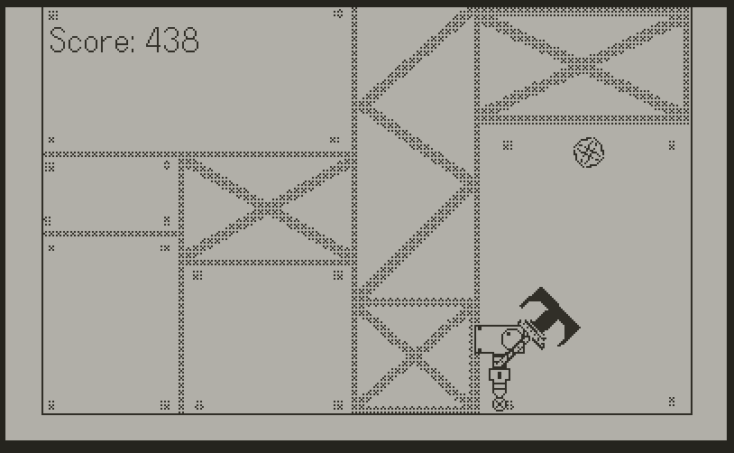

# Lonely Catch

### Context
---
I made this game over 9/03/2025 - 10/03/2025 (a little less than a day). For the CISSA x GMC Game Jam of which the theme was "A world without humans". 
It was a fun way to learn the SDK in a really small time, and I was happy with what I was able to learn in the timeframe. It was also my first major Lua project. Cool language! The C FFI is particularly cool and its impressive how fast it is. Truly a bare bones scripting language. 
   Anyway, the game isn't a masterpiece of design, but its fun enough for the context of the device. I probably wont end up submitting, because i sincerely doubt many people can even play it, because the Playdate is kinda niche.
   Have fun!
### Story 
---
All the humans are gone and now a small storage robot has nothing to do except play catch with itself in the Pit of Parcels.

### Gameplay
---
Lonely Catch is a arcade style game about bouncing a ball around. Go for more daring catches to earn a higher score multiplier, or just bounce the ball around and then catch for a simple score.

### Controls
---
- Press the **A Button** to **Shoot the ball**.
- Press **Left and Right D Pad** to move Left and Right.
- Once the ball is shot, rotate the **Crank** to aim the bouncer arm to continue bouncing the ball.
- Once ready to catch, press **Down on the D Pad** to switch to the catcher arm.
- Press the **B Button** To perform a dash once the ball has been shot.

### Installation 
---
- **Option 1**: Play the game using the Playdate Simulator by installing the SDK [Here](https://play.date/dev/).
- **Option 2**: Sideload the [.pdx](https://github.com/Chillerbag/LonelyCatch/tree/master/builds/LonelyCatch.pdx) file onto your actual physical Playdate.

### Screenshots
---

  

Title Screen.

  

Bounce the ball off your Bounce Arm!

  

Bounce the ball off the walls to increase your combo!

  

Dash and bounce the ball to add multiplier to your combo!

  

Go for crazy combos!

### Footage
---
[Here's](https://www.youtube.com/watch?v=2zemFvSHlzk) some awfully recorded footage. 
